# LLAMAS raw-frame QA — worked examples: what passes, warns and fails

*Generated by `scripts/gen_examples_doc.py` from real frames; regenerate rather than edit.*

Every frame below was run through the shipped rules exactly as `llamas-checks <file>` does.
Exit codes: **0 PASS**, **1 WARN**, **2 FAIL**, **3 unreadable file**. Each mosaic shows the 24
detectors in HDU order (one bench per row: A-side red/green/blue, then B-side), each panel stretched
to its own 1–99 % range; missing cameras are grey; a panel outlined **red** fired a FAIL rule,
**orange** a WARN rule. The zoom is the detector with the largest excess over its limit (or the
first live detector when nothing fired). "Previously" is the verdict before the 2026-09 revision
(2 %-trimmed-mean structure profiles, MAD rms, WARN/FAIL tiers, `edge_saturated`).

See `QA_CHECKS_CATALOGUE.md` for every rule and threshold.

## PASS

### FAST bias

- File: `/Users/slh/Library/CloudStorage/Box-Box/slhughes/Llamas_Commissioning_Data/20260906_07_cals/LLAMAS_2026-09-06_18-21-00.7_CAL22_mef.fits`
- Header: `BIAS` / PRODCATG `CAL.R-BIA` / READ-MDE `FAST` / REXPTIME 0.001 s / SEXPTIME 0.002 s
- **Verdict: PASS** (`llamas-checks` exit 0); previously: PASS

Normal FAST bias. 4.A.Red shows its usual left-edge glow and horizontal streaks; with the trimmed-mean structure metric this fixed pattern stays inside its cap.

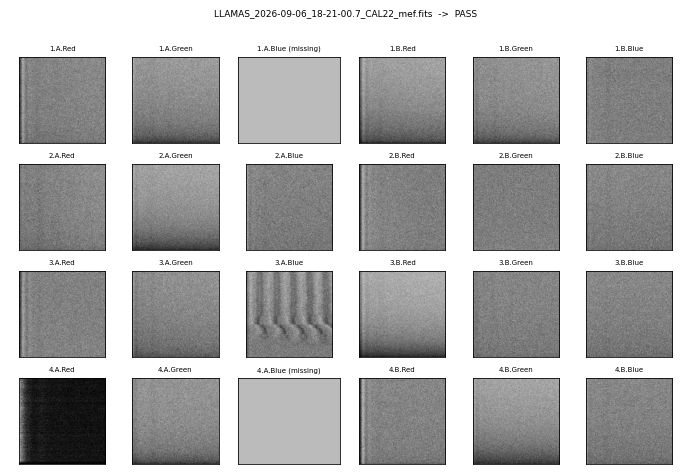

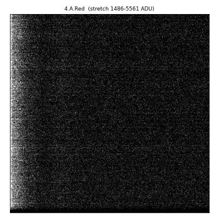

Zoomed detector 4.A.Red: median 1501 ADU, robust rms 25.2, row structure 192.21, column structure 530.42, saturated fraction 0.000.

All evaluated checks passed.


### SLOW bias

- File: `/Users/slh/Library/CloudStorage/Box-Box/slhughes/Llamas_Commissioning_Data/20260906_07_cals/LLAMAS_2026-09-06_19-04-16.9_CAL22_mef.fits`
- Header: `BIAS` / PRODCATG `CAL.R-BIA` / READ-MDE `SLOW` / REXPTIME 0.001 s / SEXPTIME 0.002 s
- **Verdict: PASS** (`llamas-checks` exit 0); previously: PASS

Normal SLOW bias: flat pedestal, read noise only.

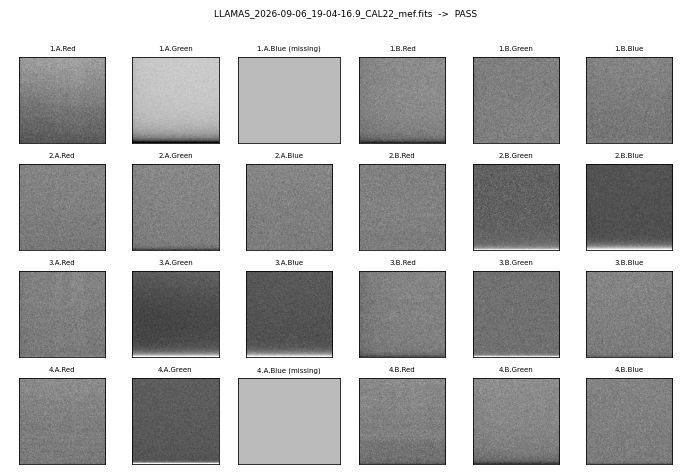

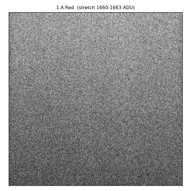

Zoomed detector 1.A.Red: median 1662 ADU, robust rms 3.0, row structure 0.24, column structure 0.07, saturated fraction 0.000.

All evaluated checks passed.


### 600 s dark

- File: `/Users/slh/Library/CloudStorage/Box-Box/slhughes/Llamas_Commissioning_Data/20260906_07_cals/LLAMAS_2026-09-06_19-39-23.0_CAL22_mef.fits`
- Header: `DARK` / PRODCATG `CAL.R-DRK` / READ-MDE `SLOW` / REXPTIME 600.0 s / SEXPTIME 600.027 s
- **Verdict: PASS** (`llamas-checks` exit 0); previously: PASS

Normal 600 s dark: level at the bias pedestal, no banding, a few hot pixels.

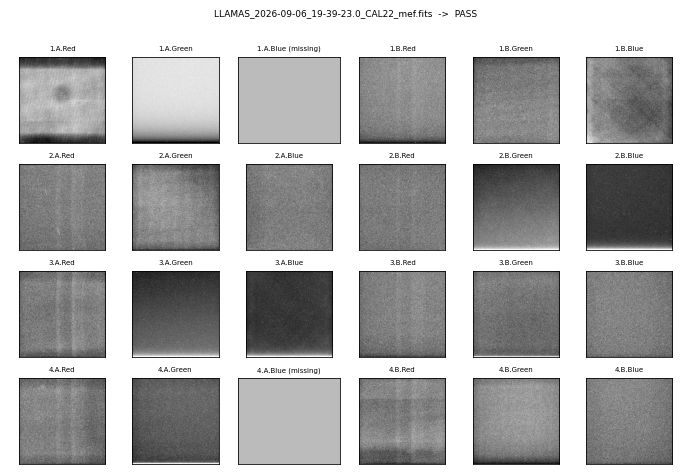

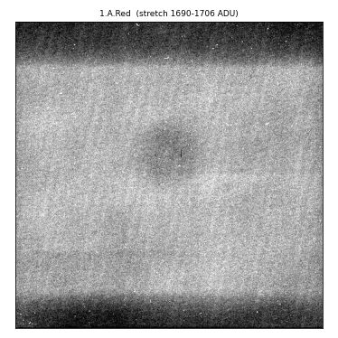

Zoomed detector 1.A.Red: median 1699 ADU, robust rms 8.9, row structure 3.15, column structure 0.40, saturated fraction 0.000.

All evaluated checks passed.


### LDLS flat, 0.07 s

- File: `/Users/slh/Library/CloudStorage/Box-Box/slhughes/Llamas_Commissioning_Data/20260906_07_cals/LLAMAS_2026-09-06_18-52-19.2_CAL22_mef.fits`
- Header: `LDLS flat` / PRODCATG `CAL.R-FLT` / READ-MDE `FAST` / REXPTIME 0.07 s / SEXPTIME 0.072 s
- **Verdict: PASS** (`llamas-checks` exit 0); previously: PASS

A short LDLS exposure (the calibration script suggests 0.07 s): fibres well exposed in the reds (peak ~65k in the brightest fibres), unilluminated edge stripes at the bias level.

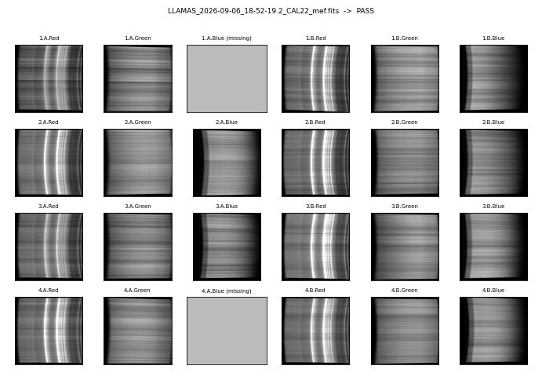

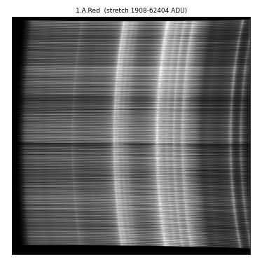

Zoomed detector 1.A.Red: median 15038 ADU, robust rms 18038.8, row structure 7769.25, column structure 9065.70, saturated fraction 0.123.

All evaluated checks passed.


### LDLS flat, 0.3 s (reds railed by a normal blue-channel exposure)

- File: `/Users/slh/Library/CloudStorage/Box-Box/slhughes/Llamas_Commissioning_Data/20260906_07_cals/LLAMAS_2026-09-06_18-53-43.1_CAL22_mef.fits`
- Header: `LDLS flat` / PRODCATG `CAL.R-FLT` / READ-MDE `FAST` / REXPTIME 0.3 s / SEXPTIME 0.302 s
- **Verdict: PASS** (`llamas-checks` exit 0); previously: PASS

A longer LDLS exposure of the kind taken for the blue channel. The red detectors are saturated over most of the illuminated area -- this is normal and expected, so the per-detector saturation caps do not fire. The edge stripes stay unsaturated.

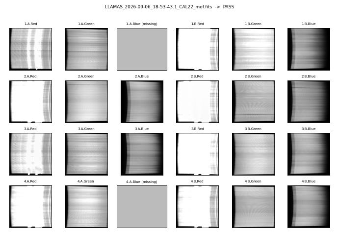

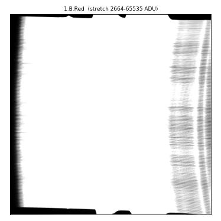

Zoomed detector 1.B.Red: median 65535 ADU, robust rms 0.0, row structure 7020.60, column structure 11872.62, saturated fraction 0.869.

All evaluated checks passed.


### ThAr arc

- File: `/Users/slh/Library/CloudStorage/Box-Box/slhughes/Llamas_Commissioning_Data/20260906_07_cals/LLAMAS_2026-09-06_18-55-49.0_CAL22_mef.fits`
- Header: `ARC ThAr` / PRODCATG `CAL.R-ARC` / READ-MDE `FAST` / REXPTIME 0.07 s / SEXPTIME 0.074 s
- **Verdict: PASS** (`llamas-checks` exit 0); previously: PASS

Normal ThAr arc: emission-line spectra on every live detector.

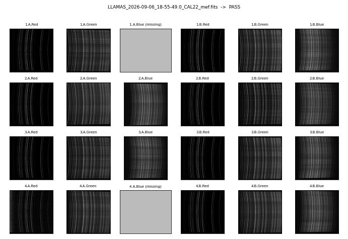

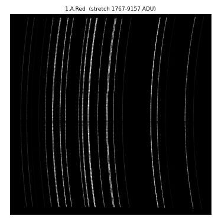

Zoomed detector 1.A.Red: median 1779 ADU, robust rms 13.3, row structure 24.88, column structure 278.91, saturated fraction 0.000.

All evaluated checks passed.


### Twilight sky flat

- File: `/Users/slh/Library/CloudStorage/Box-Box/slhughes/Llamas_Commissioning_Data/20260906_07_cals/LLAMAS_2026-09-06_22-28-03.6_CAL22_mef.fits`
- Header: `SKYFLAT` / PRODCATG `CAL.R-SKY` / READ-MDE `FAST` / REXPTIME 2.0 s / SEXPTIME 2.002 s
- **Verdict: PASS** (`llamas-checks` exit 0); previously: PASS

Normal twilight flat at a brightness comparable to the baseline set.

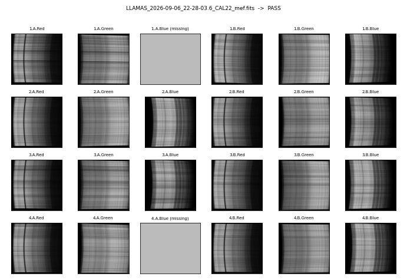

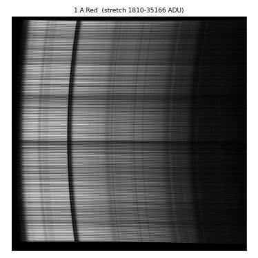

Zoomed detector 1.A.Red: median 4860 ADU, robust rms 4145.3, row structure 3444.96, column structure 5913.74, saturated fraction 0.000.

All evaluated checks passed.


### SLOW bias with hot pixels on 3.A.Red (was FAIL)

- File: `/Users/slh/Library/CloudStorage/Box-Box/slhughes/Llamas_Commissioning_Data/20260906_07_cals/LLAMAS_2026-09-06_19-08-53.8_CAL22_mef.fits`
- Header: `BIAS` / PRODCATG `CAL.R-BIA` / READ-MDE `SLOW` / REXPTIME 0.001 s / SEXPTIME 0.002 s
- **Verdict: PASS** (`llamas-checks` exit 0); previously: FAIL (3.A.Red row 3.4 vs 2.0, column 5.6 vs 2.0; rms 106 vs 25)

A few saturated pixels on 3.A.Red drove the old per-column MEAN profile and the plain std, tripping three rules on a frame that is pure read noise. The trimmed-mean profile and the MAD-based rms ignore them: nothing fires.

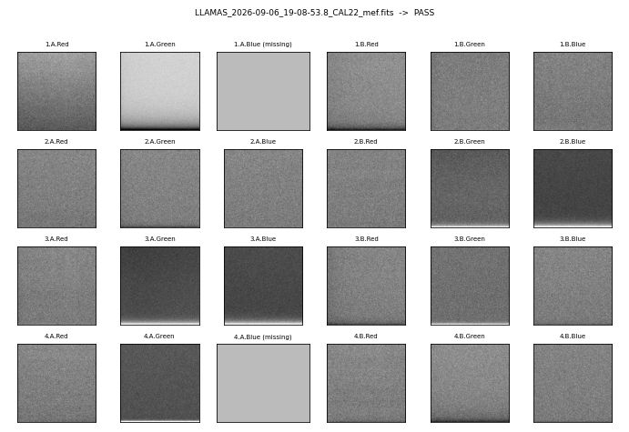

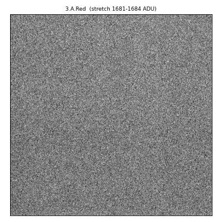

Zoomed detector 3.A.Red: median 1683 ADU, robust rms 3.0, row structure 0.06, column structure 0.06, saturated fraction 0.000.

All evaluated checks passed.


### 600 s dark with a mild 2.B.Green glow (was FAIL)

- File: `/Users/slh/Library/CloudStorage/Box-Box/slhughes/Llamas_Commissioning_Data/20260906_07_cals/LLAMAS_2026-09-06_19-28-14.2_CAL22_mef.fits`
- Header: `DARK` / PRODCATG `CAL.R-DRK` / READ-MDE `SLOW` / REXPTIME 600.0 s / SEXPTIME 600.002 s
- **Verdict: PASS** (`llamas-checks` exit 0); previously: FAIL (2.B.Green row 2.37 vs 2.30, column 4.57 vs 2.0; rms 86 vs 34)

A smooth ~5 ADU large-scale gradient (amplifier glow) plus the usual hot pixels of a 600 s integration. The hot pixels, not the glow, produced the old column excess; with the trimmed-mean profile the frame sits inside every cap.

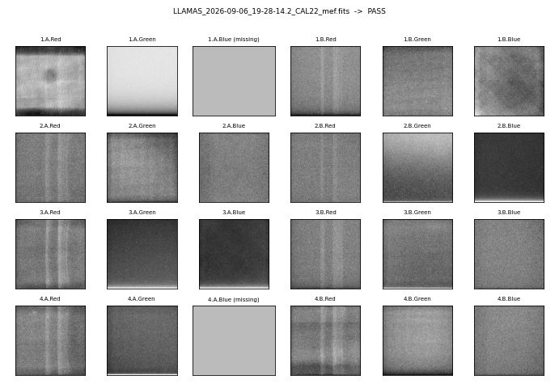

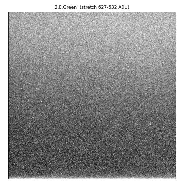

Zoomed detector 2.B.Green: median 629 ADU, robust rms 3.0, row structure 0.66, column structure 0.11, saturated fraction 0.000.

All evaluated checks passed.


### 600 s dark with glow on three detectors (was FAIL)

- File: `/Users/slh/Library/CloudStorage/Box-Box/slhughes/Llamas_Commissioning_Data/20260907_08/LLAMAS_2026-09-07_19-15-34.6_CAL22_mef.fits`
- Header: `DARK` / PRODCATG `CAL.R-DRK` / READ-MDE `SLOW` / REXPTIME 600.0 s / SEXPTIME 600.002 s
- **Verdict: PASS** (`llamas-checks` exit 0); previously: FAIL (structure on 1.A.Red, 2.A.Green, 4.A.Red at 1.4-2.9x cap; rms 85-112)

A ~16 ADU vignetting-like glow on 1.A.Red and milder gradients on two other detectors after 600 s. All of the old excess came from hot pixels and cosmic rays; the frame passes.

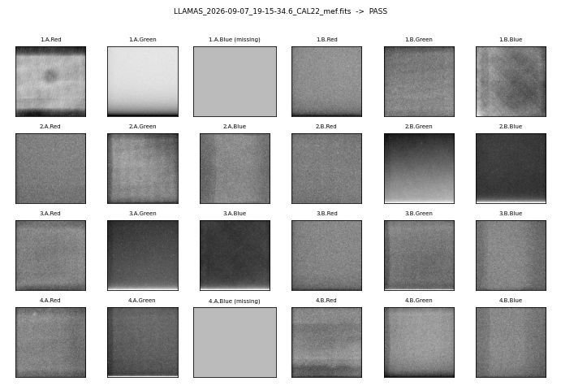

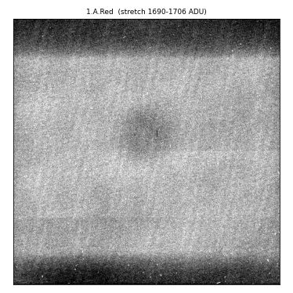

Zoomed detector 1.A.Red: median 1699 ADU, robust rms 8.9, row structure 3.15, column structure 0.36, saturated fraction 0.000.

All evaluated checks passed.


### Science frame with 4.A.Red fixed banding

- File: `/Users/slh/Library/CloudStorage/Box-Box/slhughes/Llamas_Commissioning_Data/ut20260710_11/LLAMAS_2026-07-11_05-05-22.4_SCI22_mef.fits`
- Header: `LTT7987` / PRODCATG `SCI.R-SL` / READ-MDE `FAST` / REXPTIME 1.0 s / SEXPTIME 1.002 s
- **Verdict: PASS** (`llamas-checks` exit 0); previously: PASS

Science frames run shutter, gross saturation, edge saturation, camera-warming rate and CCD temperature only. The 4.A.Red electronic banding is a fixed pattern, not a dark-current gradient, so the warming-rate check correctly ignores it.

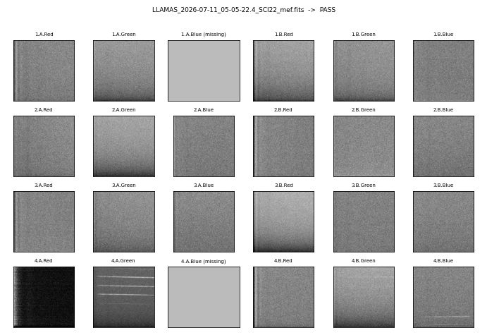

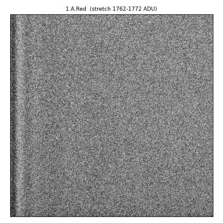

Zoomed detector 1.A.Red: median 1767 ADU, robust rms 7.4, row structure 0.27, column structure 0.49, saturated fraction 0.000.

All evaluated checks passed.


## WARN

### FAST bias with strong 4.A.Red banding (was FAIL)

- File: `/Users/slh/Library/CloudStorage/Box-Box/slhughes/Llamas_Commissioning_Data/20260906_07_cals/LLAMAS_2026-09-06_19-14-52.1_CAL22_mef.fits`
- Header: `BIAS` / PRODCATG `CAL.R-BIA` / READ-MDE `FAST` / REXPTIME 0.001 s / SEXPTIME 0.006 s
- **Verdict: WARN** (`llamas-checks` exit 1); previously: FAIL (row_structure @ 4.A.Red 382.5 vs 259.8)

The amplitude of the 4.A.Red left-edge glow and streaks varies from frame to frame and on 2026-09-06/07 ran 1.4-2x above the April-June baseline cap on most FAST biases. That is now a WARN; a FAIL needs 4x the cap (the *_gross rules), which only a real defect such as the June-4 bars reaches. Adding a September epoch to the baselines would widen this cap (see the catalogue).


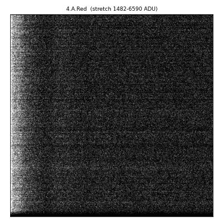

Zoomed detector 4.A.Red: median 1494 ADU, robust rms 25.2, row structure 387.82, column structure 739.02, saturated fraction 0.000.

| severity | rule | detector | value | limit |
|---|---|---|---|---|
| WARN | `column_structure` | 4.A.Red | 739 | max 706.5 |
| WARN | `row_structure` | 4.A.Red | 387.8 | max 202.4 |


### FAST bias with a saturated hot-pixel cluster on 2.A.Red (was FAIL)

- File: `/Users/slh/Library/CloudStorage/Box-Box/slhughes/Llamas_Commissioning_Data/20260906_07_cals/LLAMAS_2026-09-06_20-33-17.7_CAL22_mef.fits`
- Header: `BIAS` / PRODCATG `CAL.R-BIA` / READ-MDE `FAST` / REXPTIME 0.001 s / SEXPTIME 0.002 s
- **Verdict: WARN** (`llamas-checks` exit 1); previously: FAIL (2.A.Red row 6.1 vs 2.0, column 11.2 vs 2.0; rms 159 vs 18)

About twenty railed pixels in one column of 2.A.Red drove the old per-column MEAN profile and the plain std, tripping three rules on a detector that is pure read noise. The trimmed-mean profile and the MAD-based rms ignore them; the only thing left is the 4.A.Red banding WARN shared by most FAST biases of that night.

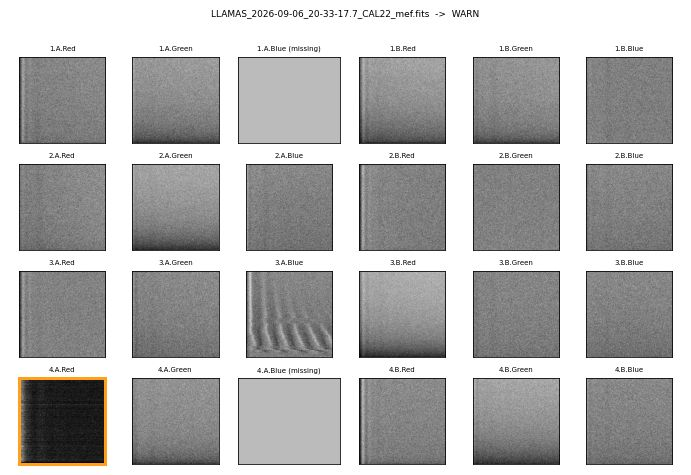

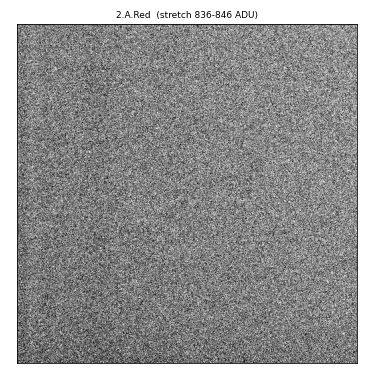

Zoomed detector 2.A.Red: median 841 ADU, robust rms 8.9, row structure 0.32, column structure 0.36, saturated fraction 0.000.

| severity | rule | detector | value | limit |
|---|---|---|---|---|
| WARN | `row_structure` | 4.A.Red | 317.4 | max 202.4 |


### Bright twilight flat (was FAIL)

- File: `/Users/slh/Library/CloudStorage/Box-Box/slhughes/Llamas_Commissioning_Data/20260906_07_cals/LLAMAS_2026-09-06_22-22-03.4_CAL22_mef.fits`
- Header: `SKYFLAT` / PRODCATG `CAL.R-SKY` / READ-MDE `SLOW` / REXPTIME 2.0 s / SEXPTIME 2.002 s
- **Verdict: WARN** (`llamas-checks` exit 1); previously: FAIL (row/column structure 1.00-1.04x cap on four blue/green detectors)

Twilight brightness varies by design and the structure metric scales with it, so structure on sky flats is WARN only. The observer logged this frame as 'good blue'. The many edge-background and saturation WARNs are the brightness itself.

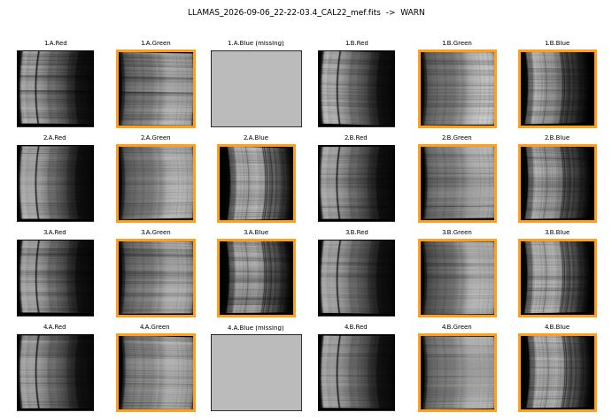

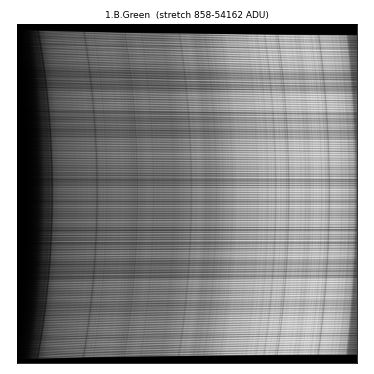

Zoomed detector 1.B.Green: median 21662 ADU, robust rms 21143.4, row structure 8004.36, column structure 9242.52, saturated fraction 0.036.

| severity | rule | detector | value | limit |
|---|---|---|---|---|
| WARN | `column_structure` | 1.B.Green | 9243 | max 8862 |
| WARN | `column_structure` | 2.A.Green | 8358 | max 8251 |
| WARN | `column_structure` | 3.A.Blue | 7272 | max 7263 |
| WARN | `edge_background_level` | 1.A.Green | 966 | min 623.3, max 845.7 |
| WARN | `edge_background_level` | 1.B.Blue | 819 | min 661.2, max 785.8 |
| WARN | `edge_background_level` | 1.B.Green | 951 | min 560.8, max 863.2 |
| WARN | `edge_background_level` | 2.A.Blue | 731 | min 502.3, max 644.7 |
| WARN | `edge_background_level` | 2.A.Green | 911 | min 537.3, max 839.7 |
| WARN | `edge_background_level` | 2.B.Blue | 645 | min 460.7, max 585.3 |
| WARN | `edge_background_level` | 2.B.Green | 843 | min 655, max 735 |
| WARN | `edge_background_level` | 3.A.Blue | 629 | min 453.7, max 578.3 |
| WARN | `edge_background_level` | 3.A.Green | 947 | min 602.1, max 877.9 |
| ... | +16 more | | | |


### LDLS flat, 0.3 s, 1.B.Red edge stripe high

- File: `/Users/slh/Library/CloudStorage/Box-Box/slhughes/Llamas_Commissioning_Data/20260906_07_cals/LLAMAS_2026-09-06_18-53-57.5_CAL22_mef.fits`
- Header: `LDLS flat` / PRODCATG `CAL.R-FLT` / READ-MDE `FAST` / REXPTIME 0.3 s / SEXPTIME 0.304 s
- **Verdict: WARN** (`llamas-checks` exit 1); previously: WARN (edge_background_level @ 1.B.Red)

The unilluminated stripe on 1.B.Red is brighter than the baseline band (scattered light at a longer exposure) but far from saturated.

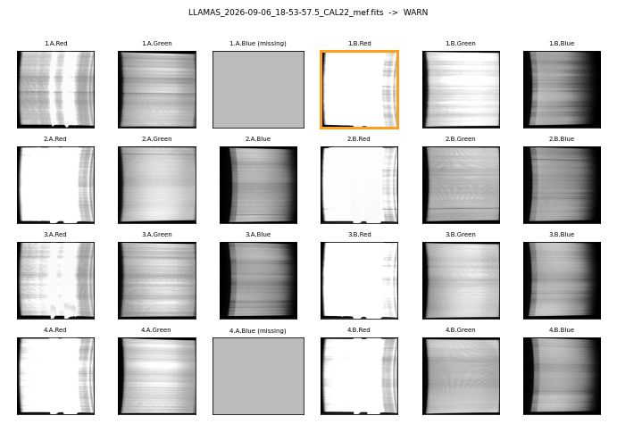

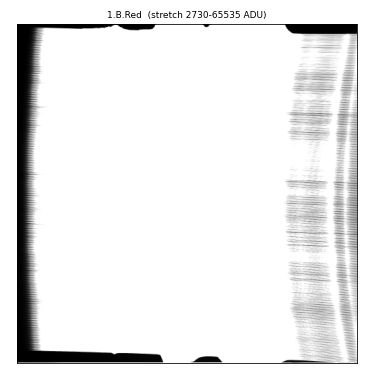

Zoomed detector 1.B.Red: median 65535 ADU, robust rms 0.0, row structure 6615.70, column structure 11685.17, saturated fraction 0.880.

| severity | rule | detector | value | limit |
|---|---|---|---|---|
| WARN | `edge_background_level` | 1.B.Red | 6979 | min -1779, max 5783 |


### Science frame with a warming camera (3.A.Green)

- File: `/Users/slh/Downloads/20260505_06-selected/LLAMAS_2026-05-06_06-08-21.4_SCI22_mef.fits`
- Header: `LTT4816` / PRODCATG `SCI.R-SL` / READ-MDE `SLOW` / REXPTIME 10.0 s / SEXPTIME 10.065 s
- **Verdict: WARN** (`llamas-checks` exit 1); previously: WARN (camera_warming_gradient @ 3.A.Green)

Dark-current glow growing at ~2.1 ADU/s on 3.A.Green while the header CCD temperature still reads its baseline value. Advisory: check the camera.

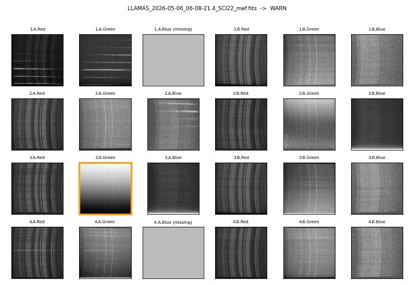

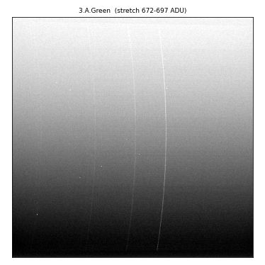

Zoomed detector 3.A.Green: median 685 ADU, robust rms 10.4, row structure 7.92, column structure 0.23, saturated fraction 0.000.

| severity | rule | detector | value | limit |
|---|---|---|---|---|
| WARN | `camera_warming_gradient` | 3.A.Green | 2.086 | max 1.3 |


## FAIL

### LDLS flat, 0.07 s, railed on every detector

- File: `/Users/slh/Library/CloudStorage/Box-Box/slhughes/Llamas_Commissioning_Data/20260907_08/LLAMAS_2026-09-07_18-17-12.8_CAL22_mef.fits`
- Header: `LDLS flat` / PRODCATG `CAL.R-FLT` / READ-MDE `FAST` / REXPTIME 0.07 s / SEXPTIME 0.072 s
- **Verdict: FAIL** (`llamas-checks` exit 2); previously: WARN (28 warn checks, exit 1)

Light flooded the whole detector: medians of 64-65k on all 22 live detectors, and the unilluminated bottom stripe itself is at the ADC ceiling. The new edge_saturated rule makes this a FAIL. A normal 0.07 s flat (see PASS) has red medians of 15-26k.

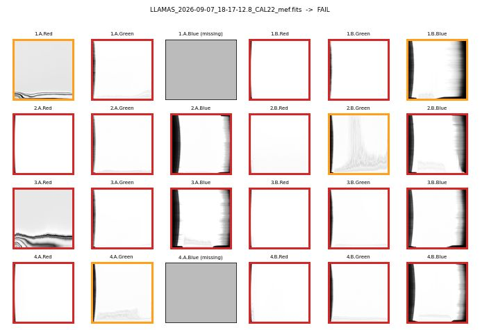

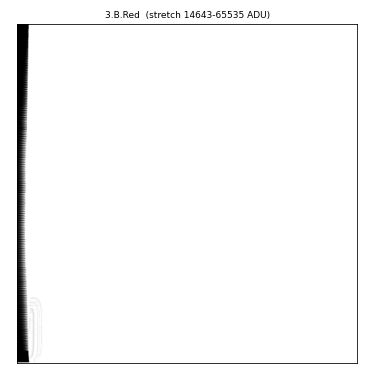

Zoomed detector 3.B.Red: median 65535 ADU, robust rms 0.0, row structure 285.62, column structure 7118.28, saturated fraction 0.972.

| severity | rule | detector | value | limit |
|---|---|---|---|---|
| FAIL | `edge_saturated` | 1.A.Green | 6.346e+04 | max 6.3e+04 |
| FAIL | `edge_saturated` | 1.B.Green | 6.554e+04 | max 6.3e+04 |
| FAIL | `edge_saturated` | 1.B.Red | 6.554e+04 | max 6.3e+04 |
| FAIL | `edge_saturated` | 2.A.Blue | 6.348e+04 | max 6.3e+04 |
| FAIL | `edge_saturated` | 2.A.Green | 6.473e+04 | max 6.3e+04 |
| FAIL | `edge_saturated` | 2.A.Red | 6.554e+04 | max 6.3e+04 |
| FAIL | `edge_saturated` | 2.B.Blue | 6.554e+04 | max 6.3e+04 |
| FAIL | `edge_saturated` | 2.B.Red | 6.426e+04 | max 6.3e+04 |
| FAIL | `edge_saturated` | 3.A.Blue | 6.505e+04 | max 6.3e+04 |
| FAIL | `edge_saturated` | 3.A.Green | 6.403e+04 | max 6.3e+04 |
| FAIL | `edge_saturated` | 3.A.Red | 6.393e+04 | max 6.3e+04 |
| FAIL | `edge_saturated` | 3.B.Blue | 6.384e+04 | max 6.3e+04 |
| ... | +34 more | | | |


### LDLS flat, 0.3 s, edge stripes railed in the reds

- File: `/Users/slh/Library/CloudStorage/Box-Box/slhughes/Llamas_Commissioning_Data/20260907_08/LLAMAS_2026-09-07_18-18-55.0_CAL22_mef.fits`
- Header: `LDLS flat` / PRODCATG `CAL.R-FLT` / READ-MDE `FAST` / REXPTIME 0.3 s / SEXPTIME 0.306 s
- **Verdict: FAIL** (`llamas-checks` exit 2); previously: WARN (13 warn checks, exit 1)

Reds and greens railed and the red edge stripes at 65535, with the blues 2-4x brighter than a normal 0.3 s step. Railed reds alone are normal at this exposure (see PASS); a saturated unilluminated stripe is not.

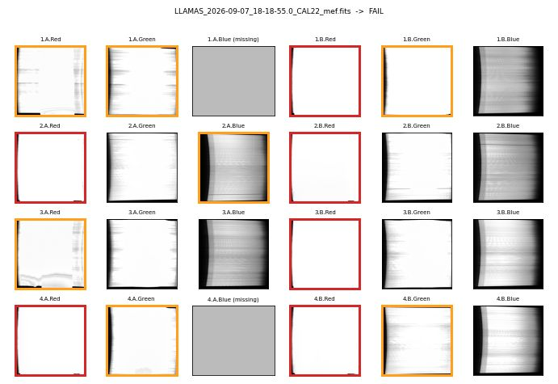

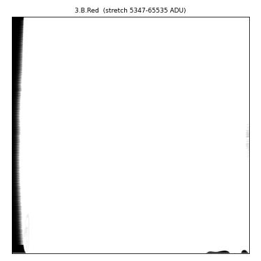

Zoomed detector 3.B.Red: median 65535 ADU, robust rms 0.0, row structure 889.20, column structure 9717.55, saturated fraction 0.962.

| severity | rule | detector | value | limit |
|---|---|---|---|---|
| FAIL | `edge_saturated` | 1.B.Red | 6.554e+04 | max 6.3e+04 |
| FAIL | `edge_saturated` | 2.A.Red | 6.554e+04 | max 6.3e+04 |
| FAIL | `edge_saturated` | 2.B.Red | 6.41e+04 | max 6.3e+04 |
| FAIL | `edge_saturated` | 3.B.Red | 6.554e+04 | max 6.3e+04 |
| FAIL | `edge_saturated` | 4.A.Red | 6.517e+04 | max 6.3e+04 |
| FAIL | `edge_saturated` | 4.B.Red | 6.511e+04 | max 6.3e+04 |
| WARN | `edge_background_level` | 1.A.Green | 2516 | min -330.5, max 2400 |
| WARN | `edge_background_level` | 1.A.Red | 4.95e+04 | min -214.3, max 4251 |
| WARN | `edge_background_level` | 1.B.Green | 4.606e+04 | min -679.2, max 3208 |
| WARN | `edge_background_level` | 1.B.Red | 6.554e+04 | min -1779, max 5783 |
| WARN | `edge_background_level` | 2.A.Blue | 1906 | min -22.99, max 1854 |
| WARN | `edge_background_level` | 2.A.Red | 6.554e+04 | min -2128, max 4571 |
| ... | +7 more | | | |


### 600 s dark with periodic column bars (June 4)

- File: `/Users/slh/Library/CloudStorage/Box-Box/slhughes/LLAMAS_analysis/QA_baselines/copies/LLAMAS_2026-06-04_20-36-33.1_CAL22_mef.fits`
- Header: `DARK` / PRODCATG `CAL.R-DRK` / READ-MDE `SLOW` / REXPTIME 600.0 s / SEXPTIME 600.002 s
- **Verdict: FAIL** (`llamas-checks` exit 2); previously: FAIL (column_structure @ 2.B.Green)

Full-height vertical bars across 2.B.Green, ~13 ADU peak to peak: an unambiguous electronic defect, several times the gross (4x) cap.

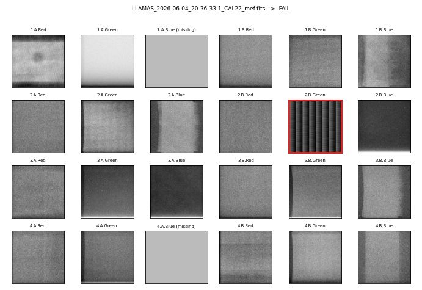

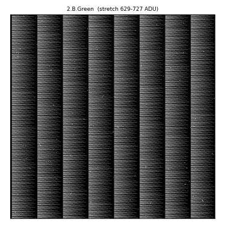

Zoomed detector 2.B.Green: median 632 ADU, robust rms 4.4, row structure 6.68, column structure 13.28, saturated fraction 0.000.

| severity | rule | detector | value | limit |
|---|---|---|---|---|
| FAIL | `column_structure_gross` | 2.B.Green | 13.28 | max 8 |
| WARN | `column_structure` | 2.B.Green | 13.28 | max 2 |
| WARN | `row_structure` | 2.B.Green | 6.68 | max 2.193 |


### ThAr arc with odd structure on every detector (July 10)

- File: `/Users/slh/Library/CloudStorage/Box-Box/slhughes/Llamas_Commissioning_Data/ut20260710_11/LLAMAS_2026-07-10_20-22-43.7_CAL22_mef.fits`
- Header: `ARC ThAr` / PRODCATG `CAL.R-ARC` / READ-MDE `FAST` / REXPTIME 0.07 s / SEXPTIME 0.074 s
- **Verdict: FAIL** (`llamas-checks` exit 2); previously: FAIL (column_structure on 22/22 detectors)

Blooming/excess structure on every live detector relative to the fixed-lamp ThAr baseline. Structure on fixed-lamp frames (ThAr, LDLS) remains a FAIL at the cap.

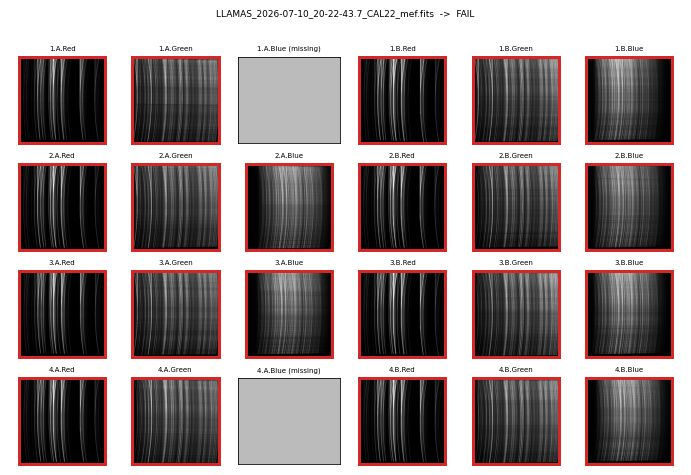

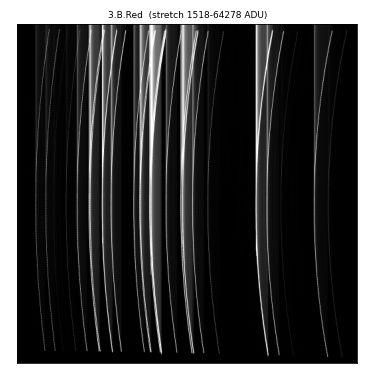

Zoomed detector 3.B.Red: median 2409 ADU, robust rms 1246.9, row structure 2659.93, column structure 8910.52, saturated fraction 0.029.

| severity | rule | detector | value | limit |
|---|---|---|---|---|
| FAIL | `column_structure` | 1.A.Green | 79.01 | max 34.26 |
| FAIL | `column_structure` | 1.A.Red | 5805 | max 2078 |
| FAIL | `column_structure` | 1.B.Blue | 120.1 | max 50.66 |
| FAIL | `column_structure` | 1.B.Green | 120 | max 52.99 |
| FAIL | `column_structure` | 1.B.Red | 8514 | max 3569 |
| FAIL | `column_structure` | 2.A.Blue | 135.7 | max 55.23 |
| FAIL | `column_structure` | 2.A.Green | 96.77 | max 41.86 |
| FAIL | `column_structure` | 2.A.Red | 7801 | max 3279 |
| FAIL | `column_structure` | 2.B.Blue | 130.3 | max 49.81 |
| FAIL | `column_structure` | 2.B.Green | 120.3 | max 52.09 |
| FAIL | `column_structure` | 2.B.Red | 8251 | max 3463 |
| FAIL | `column_structure` | 3.A.Blue | 121.4 | max 50.82 |
| ... | +40 more | | | |


### Science frame with a shutter fault (600 s requested)

- File: `/Users/slh/Downloads/20260505_06-selected/LLAMAS_2026-05-06_05-10-56.6_SCI22_mef.fits`
- Header: `ZTFJ1312p1031` / PRODCATG `SCI.R-SL` / READ-MDE `SLOW` / REXPTIME 600.0 s / SEXPTIME 180.946 s
- **Verdict: FAIL** (`llamas-checks` exit 2); previously: FAIL (shutter_exptime_consistency)

SEXPTIME 181 s against REXPTIME 600 s: the shutter closed early.

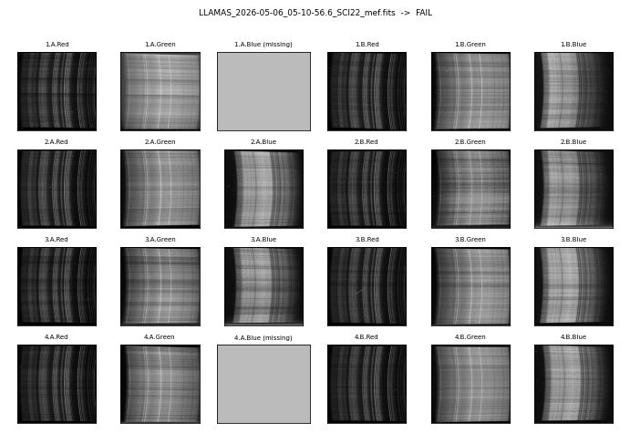

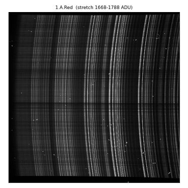

Zoomed detector 1.A.Red: median 1677 ADU, robust rms 10.4, row structure 5.56, column structure 7.36, saturated fraction 0.000.

| severity | rule | detector | value | limit |
|---|---|---|---|---|
| FAIL | `shutter_exptime_consistency` | - | 419.1 | abs_tol 1, rel_tol 0.1 |


### Bias with the shutter open

- File: `/Users/slh/Downloads/20260505_06-selected/LLAMAS_2026-05-06_05-56-30.7_CAL0_mef.fits`
- Header: `BIAS` / PRODCATG `CAL.R-BIA` / READ-MDE `SLOW` / REXPTIME 0.001 s / SEXPTIME 0.352 s
- **Verdict: FAIL** (`llamas-checks` exit 2); previously: FAIL (shutter_exptime_consistency)

SEXPTIME 0.352 s for a 0.001 s bias: not a bias.

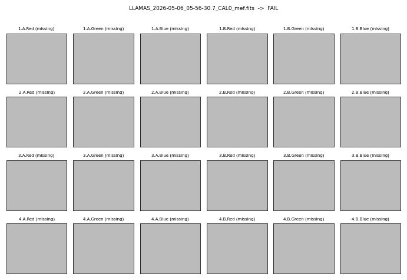

(no live detector in this frame; only the header checks run.)

| severity | rule | detector | value | limit |
|---|---|---|---|---|
| FAIL | `shutter_exptime_consistency` | - | 0.351 | abs_tol 0.214, rel_tol 0.1 |


### Baseline LDLS flat with a shutter overrun (June 30)

- File: `/Users/slh/Library/CloudStorage/Box-Box/slhughes/LLAMAS_analysis/QA_baselines/lamp_flats/LLAMAS_2026-06-30_19-33-58.0_CAL22_mef.fits`
- Header: `LDLS flat` / PRODCATG `CAL.R-FLT` / READ-MDE `FAST` / REXPTIME 0.15 s / SEXPTIME 0.246 s
- **Verdict: FAIL** (`llamas-checks` exit 2); previously: PASS (undetected)

REXPTIME 0.15 s but SEXPTIME 0.246 s (inside the shutter tolerance), leaving the red edge stripes at 65535. Newly caught by edge_saturated; it stays in the baseline set because the level bands are MAD-robust and it is documented here.

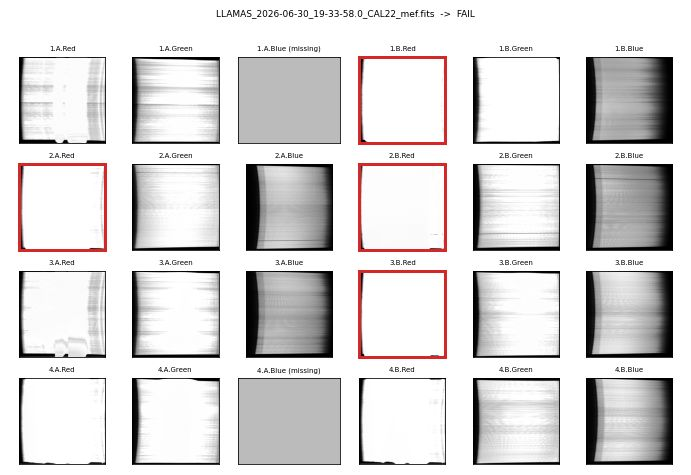

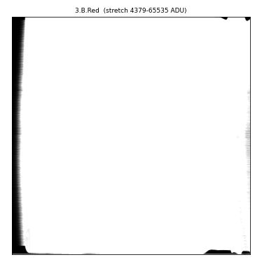

Zoomed detector 3.B.Red: median 65535 ADU, robust rms 0.0, row structure 1834.86, column structure 10154.11, saturated fraction 0.956.

| severity | rule | detector | value | limit |
|---|---|---|---|---|
| FAIL | `edge_saturated` | 1.B.Red | 6.554e+04 | max 6.3e+04 |
| FAIL | `edge_saturated` | 2.A.Red | 6.554e+04 | max 6.3e+04 |
| FAIL | `edge_saturated` | 2.B.Red | 6.405e+04 | max 6.3e+04 |
| FAIL | `edge_saturated` | 3.B.Red | 6.554e+04 | max 6.3e+04 |
| WARN | `edge_background_level` | 1.B.Red | 6.554e+04 | min -1779, max 5783 |
| WARN | `edge_background_level` | 2.A.Red | 6.554e+04 | min -2128, max 4571 |
| WARN | `edge_background_level` | 2.B.Red | 6.405e+04 | min -1426, max 5558 |
| WARN | `edge_background_level` | 3.B.Red | 6.554e+04 | min -2760, max 6856 |


## ERROR

### Truncated file

- File: `/Users/slh/Library/CloudStorage/Box-Box/slhughes/Llamas_Commissioning_Data/ut20260710_11/LLAMAS_2026-07-11_10-19-11.8_SCI22_mef.fits`
- Header: `Feige110` / PRODCATG `SCI.R-SL` / READ-MDE `SLOW` / REXPTIME 60.0 s / SEXPTIME 60.133 s
- **Verdict: unreadable** (`llamas-checks` exit 3); previously: exit 3

The file cannot be read to the end; `llamas-checks` exits 3 (system error), the batch engine reports ERROR.

```
ValueError: cannot reshape array of size 3967936 into shape (2048,2048)
```

## Summary of verdict changes

| case | previously | now | exit |
|---|---|---|---|
| FAST bias | PASS | **PASS** | 0 |
| SLOW bias | PASS | **PASS** | 0 |
| 600 s dark | PASS | **PASS** | 0 |
| LDLS flat, 0.07 s | PASS | **PASS** | 0 |
| LDLS flat, 0.3 s (reds railed by a normal blue-channel exposure) | PASS | **PASS** | 0 |
| ThAr arc | PASS | **PASS** | 0 |
| Twilight sky flat | PASS | **PASS** | 0 |
| SLOW bias with hot pixels on 3.A.Red (was FAIL) | FAIL (3.A.Red row 3.4 vs 2.0, column 5.6 vs 2.0; rms 106 vs 25) | **PASS** | 0 |
| 600 s dark with a mild 2.B.Green glow (was FAIL) | FAIL (2.B.Green row 2.37 vs 2.30, column 4.57 vs 2.0; rms 86 vs 34) | **PASS** | 0 |
| 600 s dark with glow on three detectors (was FAIL) | FAIL (structure on 1.A.Red, 2.A.Green, 4.A.Red at 1.4-2.9x cap; rms 85-112) | **PASS** | 0 |
| Science frame with 4.A.Red fixed banding | PASS | **PASS** | 0 |
| FAST bias with strong 4.A.Red banding (was FAIL) | FAIL (row_structure @ 4.A.Red 382.5 vs 259.8) | **WARN** | 1 |
| FAST bias with a saturated hot-pixel cluster on 2.A.Red (was FAIL) | FAIL (2.A.Red row 6.1 vs 2.0, column 11.2 vs 2.0; rms 159 vs 18) | **WARN** | 1 |
| Bright twilight flat (was FAIL) | FAIL (row/column structure 1.00-1.04x cap on four blue/green detectors) | **WARN** | 1 |
| LDLS flat, 0.3 s, 1.B.Red edge stripe high | WARN (edge_background_level @ 1.B.Red) | **WARN** | 1 |
| Science frame with a warming camera (3.A.Green) | WARN (camera_warming_gradient @ 3.A.Green) | **WARN** | 1 |
| LDLS flat, 0.07 s, railed on every detector | WARN (28 warn checks, exit 1) | **FAIL** | 2 |
| LDLS flat, 0.3 s, edge stripes railed in the reds | WARN (13 warn checks, exit 1) | **FAIL** | 2 |
| 600 s dark with periodic column bars (June 4) | FAIL (column_structure @ 2.B.Green) | **FAIL** | 2 |
| ThAr arc with odd structure on every detector (July 10) | FAIL (column_structure on 22/22 detectors) | **FAIL** | 2 |
| Science frame with a shutter fault (600 s requested) | FAIL (shutter_exptime_consistency) | **FAIL** | 2 |
| Bias with the shutter open | FAIL (shutter_exptime_consistency) | **FAIL** | 2 |
| Baseline LDLS flat with a shutter overrun (June 30) | PASS (undetected) | **FAIL** | 2 |
| Truncated file | exit 3 | **unreadable** | 3 |
